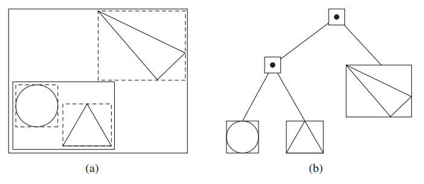
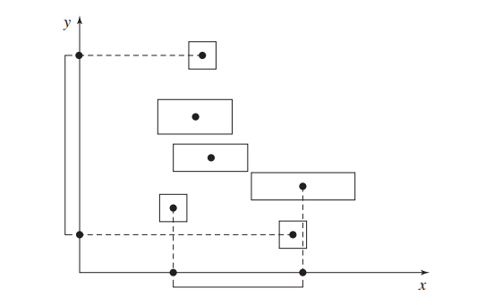

# 1.1 Bounding volume hierarchies
包围体层次结构根据图元细分实现了一种光线相交加速方案. 如下图所示:

图元集合的包围盒由虚线表示, 图元的分组方式根据邻近程度予以实现. 圆和正三角形由一个包围盒包围, 整个场景又由一个大包围盒包围起来(这两个包围盒用实线表示). 最终就会构造出(b)所示的二叉树.



表示 BVH 所需要的内存通常是有限并且可计算的. 对于各个叶子节点存储单一图元的 BVH 二叉树而言, 全部节点数量最多为 $2n-1$, 其中 $n$ 表示图元数量, 叶子节点和内部节点数量分别为 $n$ 和 $n-1$.

与 BVH 相比, 后面要介绍的 kd 树通常可以实现快速的相交计算, 但是其构造过程要更长一些. 另外与 kd 树相比, BVH 具有更好的数值健壮性以及针对舍入误差问题的抗干扰性.

# 1.2 构建 BVH
构建 BVH 分为三个阶段. 首先计算所有图元的包围信息存储在数组中. 然后将根据 *splitMethod* 指定的算法来构建 BVH 二叉树. 最后将这个树形结构转换为更紧凑的无指针表达方式, 以供渲染操作使用.

我们定义一个结构体 *BVHPrimitiveInfo* 来存储 BVH. 每个 BVHPrimitiveInfo 实例都保存着图元的中心, 包围盒以及其在 BVHPrimitiveInfo 数组中的下标.

```c++
// BVHPrimitiveInfo 结构体
struct BVHPrimitiveInfo {
	BVHPrimitiveInfo(size_t primitiveNumber, const Bounds3f &bounds)
	: primitiveNumber(primitiveNumber), bounds(bounds),
	centroid(.5f * bounds.pMin + .5f * bounds.pMax) { }

	size_t primitiveNumber;
	Bounds3f bounds;
	Point3f centroid;
};

// 初始化 primitiveInfo 数组
std::vector<BVHPrimitiveInfo> primitiveInfo(primitives.size());
for (size_t i = 0; i < primitives.size(); ++i)
	primitiveInfo[i] = { i, primitives[i]->WorldBound() };
```

接下来就可以开始递归构造过程了.

其中 MemoryArena 用来管理内存, totalNodes 指明了树节点的数量, root 为树的根节点, orderedPrims 是树构造之后返回的新的图原数组. orderedPrims 中的图元是排序的, 叶子节点中的图元占据了数组中连续的范围. 最后原始图原数组会被 orderedPrims 代替.

```c++
// 使用 primitiveInfo 为图元构造 BVH 树
MemoryArena arena(1024 * 1024);
int totalNodes = 0;
std::vector<std::shared_ptr<Primitive>> orderedPrims;
BVHBuildNode *root;
if (splitMethod == SplitMethod::HLBVH)
	root = HLBVHBuild(arena, primitiveInfo, &totalNodes, orderedPrims);
else
	root = recursiveBuild(arena, primitiveInfo, 0, primitives.size(), &totalNodes, orderedPrims);

primitives.swap(orderedPrims);
```

BVHBuildNode 表示 BVH 树的一个节点, 每个节点都保存了一个包围盒, 这个包围盒表示了该节点下所有节点的边界. 每个节点还会保存两个指向其自身子节点的指针. Interior nodes also record the coordinate axis
along which primitives were partitioned for distribution to their two children; this
information is used to improve the performance of the traversal algorithm. 叶节点中需要记录哪些图元存储在其中, 这些图元利用有一个偏移量和一个数量来表示, 所以原始图原数组是需要重新排序的. 另外我们通过一个节点的 children 是否为空来区分内部节点和叶节点.

```c++
struct BVHBuildNode {
	// 初始化叶节点
	void InitLeaf(int first, int n, const Bounds3f &b) {
		firstPrimOffset = first;
		nPrimitives = n;
		bounds = b;
		children[0] = children[1] = nullptr;
	}

	// 初始化内部节点
	void InitInterior(int axis, BVHBuildNode *c0, BVHBuildNode *c1) {
		children[0] = c0;
		children[1] = c1;
		bounds = Union(c0->bounds, c1->bounds);
		splitAxis = axis;
		nPrimitives = 0;
	}

	Bounds3f bounds;
	BVHBuildNode *children[2];
	int splitAxis, firstPrimOffset, nPrimitives;
};
```

recursiveBuild 还接受两个参数 start 和 end. 这两个参数表示了需要构造 BVH 的 primitiveInfo 子集. 其中从 primitiveInfo[start] 到 primitiveInfo[end - 1] 会被用来构造 BVH (也就是说 end - start 实际上表示子集中 BVHPrimitiveInfo 对象的数量). 当这个范围内只有一个图元的时候递归操作将至最低点并产生一个叶子节点. 否则, 将根据某一种算法将这个子集再次分为两个子集, 并重新排序. [start, mid) 和 [mid, end) 两个子集将进入递归, 他们的返回结果就是当前节点的两个子节点.

totalNodes 记录所有节点的数量, 利用他可以为后面的 LinearBVHNodes 提供更为准确的内存空间. 在叶节点存储图元的时候, 我们需要同时处理 orderedPrims. 只有这样我们才可以在叶节点中利用 firstPrimOffset 和 nPrimitives 来表示叶子中存储的图元.

综上我们可以给出 recursiveBuild 的实现如下.
```c++
BVHBuildNode *BVHAccel::recursiveBuild(MemoryArena &arena,
		std::vector<BVHPrimitiveInfo> &primitiveInfo, int start,
		int end, int *totalNodes,
		std::vector<std::shared_ptr<Primitive>> &orderedPrims) {
	BVHBuildNode *node = arena.Alloc<BVHBuildNode>();
	(*totalNodes)++;
	// <> 是文学编程(Literate Program)使用的符号, 约等于注释, 用一句话来描述功能, 代替大段的实现代码.
	<计算[start, end)中所有图元的包围盒>
	int nPrimitives = end - start;
	if (nPrimitives == 1) {
		<创建叶节点>
	} else {
		<计算图元包围盒中心并确定划分的轴向>
		<将图元分为两部分并创建子节点>
	}
	return node;
}
```

```c++
<计算[start, end)中所有图元的包围盒>≡
	Bounds3f bounds;
	for (int i = start; i < end; ++i)
		bounds = Union(bounds, primitiveInfo[i].bounds);

<创建叶节点>≡
	int firstPrimOffset = orderedPrims.size();
	for (int i = start; i < end; ++i) {
		int primNum = primitiveInfo[i].primitiveNumber;
		orderedPrims.push_back(primitives[primNum]);
	}
	node->InitLeaf(firstPrimOffset, nPrimitives, bounds);
	return node;
```

对于内部节点, 我们首先需要将图元进行划分, 进而构造两颗子树. 在构造 BVH 时通常会沿某一个轴向进行划分. 对于有当前图元集合, 可以选择具有最大包围盒质心范围的轴向. 对于下图的二维环境中, 沿 y 轴具有最大范围, 因此图元将沿着 y 轴进行划分.



```c++
<计算图元包围盒中心并确定划分的轴向>≡
	Bounds3f centroidBounds;
	for (int i = start; i < end; ++i)
		centroidBounds = Union(centroidBounds, primitiveInfo[i].centroid);

	int dim = centroidBounds.MaximumExtent();
```