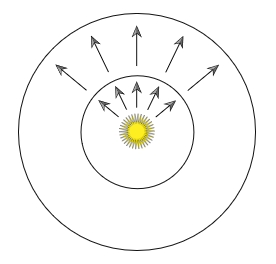

# 辐射度测量

## 1. 概述

辐射测量提供了一套用于描述光线传播和反射的思想以及数学工具, 他构成了渲染算法的基础. 但需要注意的是他最初并不是用来研究光学的, 而是在空间粒子的基础上进行适当抽象. 所以诸如光的偏振等效果并不适用这个框架. 不过与麦克斯韦方程组建立的连接为辐射度测量提供了坚实的物理学基础.

辐射传输是研究辐射能的一门学科, 他基于辐射原理并在几何光学水平上进行操作. 因为光的宏观特性足以描述光是如何与远大于波长的物体进行相互作用的, 所以很少根据波光学模型整合光学现象, 此类结果需要通过辐射传输的基础抽象语言加以表达. 通过这种方式我们可以描述光与具有与光的波长大致相同尺寸的物体的相互作用, 对光的色散和干涉等现象进行建模.

在更进一步的微观尺度上我们需要量子力学进行研究, 但是幸运的是在图形渲染领域, 我们不需要考虑这种问题.

在 pbrt 系统中, 我们假设几何光学是一个合适的模型, 可以用来描述光以及光的散射. 这将会引出一些关于光的行为的假设并隐含与整个系统中.

- 线性关系( *Linearity* ): 多个光源的共同作用等价于各自独立作用之和.
- 能量守恒( *Energy conservation* ): 当光线发生散射时不会产生额外的能量.
- 忽略偏振( *No polarization* ): 基于波长的分布状态将成为光的唯一相关特性.
- 忽略荧光或磷光现象( *No fluorescence or phosphorescence* ): 与偏振类似, 实用价值较低.
- 稳定的状态( *Steady state* ): 假设环境中的光已达到平衡, 因此其辐射分布不随时间变化. 这在现实场景中几乎瞬间发生, 因此在实践中不是限制. 注意, 之前提到的磷光便违反了稳态假设。

当采用几何光学模型的时候, 最重大的损失就是衍射和干涉现象通常难以处理. 在展示这些现象的时候, 两个区域的总通量并不等于各自通量的和( Preisendorfer, 1965, 24页 ).

---

## 2. 基础物理量

渲染关注辐射度测量的四个基本量: 通量( flux ), 入射辐射度/出射辐射度( irradiance / radiant exitance ), 强度( intensity ), 辐射度( radiance ). 这些量可以通过对时间, 面积, 方向等属性进行限制, 进而通过能量得出( 以焦耳为单位 ). 他们通常取决于波长, 接下来我们不会明确的表达这种依赖, 但需要谨记这很重要.

### 2.1 能量

我们以焦耳为单位统计能量. 光源会向外发射光子, 每一个光子都处于特定的波长并携带一份特定量的能量. 所有基本辐射量都是测量光子的有效方式. 其中一个波长为 $\lambda$ 的光子所携带的能量如下

$$
Q = \frac{hc}{\lambda} \\
光速 c \approx 299,472,458 m/s, 普朗克常量 h \approx 6.626 * 10^{-34} m^2kg/s
$$

### 2.2 通量 Flux

通量也被称为功率, 他表示在单位时间内通过一个表面或空间中某个区域的总能量. 辐射通量可以利用下式计算:

$$
\Phi = \lim_{\Delta t \to 0}\frac{\Delta Q}{\Delta t}=\frac{dQ}{dt}
$$

通量的单位是焦耳每秒( J/s ), 或者更常用的瓦特( W ).

相反, 我们也可以根据时间的积分来求出一段时间内的总能量:

$$
Q=\int_{t1}^{t2}\Phi(t)dt
$$

需要留意的是在其他问题上, 因为光子实际上是离散的量子, 对时间微分是没有意义的. 但是对于渲染而言, 相对于我们关注的测量范围内光子的数量足够巨大, 在实践中这个细节不会产生问题. (*Note that our notation here is slightly informal: among other issues, because photons are actually discrete quanta, it’s not really meaningful to take limits that go to zero for differential time. For the purposes of rendering, where the number of photons is enormous with respect to the measurements we’re interested in, this detail isn’t problematic in practice.*)

我们通常用通量来描述一个光源发射的总能量, 下图展示了通量的含义. 值得注意的是虽然在较大的球上每一个小区域所通过的能量都要比小球上相应的区域少, 但是因为面积的补偿, 通过两个球面的总能量实际上的相等的.

### 2.3 入射辐射度/出射辐射度 Irradiance and Radiant Exitance

待更新 ...